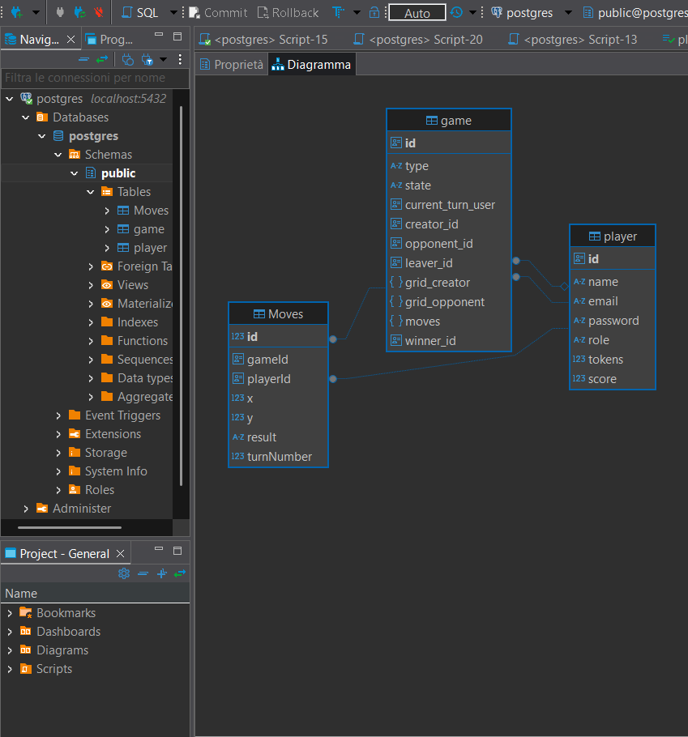

# 🚢 BATTLESHIP – Backend
Il seguente progetto è stato sviluppato come parte dell’esame di **Programmazione Avanzata** (A.A. 2024/2025) presso l'**Università Politecnica delle Marche**, all’interno del **Corso di Laurea Magistrale in Ingegneria Informatica e dell’Automazione (LM-32)**.

Il progetto propone un sistema backend per la gestione del gioco della **battaglia navale**, consentendo agli utenti di giocare contro altri utenti o contro un'**intelligenza artificiale (IA)**. Il sistema supporta la gestione di più partite contemporaneamente, sebbene ciascun utente possa partecipare attivamente a una sola partita alla volta.

## Strumenti utilizzati
- **Linguaggio**: TypeScript
- **Backend**: Node.js + Express
- **ORM**: Sequelize
- **Database**: PostgreSQL
- **Autenticazione**: JWT (JSON Web Tokens)

## Funzionalità principali
L’utente ha la possibilità di:

 * Creare una nuova partita, specificando:
   - Tipo di avversario (utente o IA),
   - Email dell’avversario (se presente),
   - Griglia di gioco,
   - Numero e dimensioni delle navi,
* Effettuare una mossa a turno, con accesso allo **storico delle mosse** della partita corrente;
* Valutare lo **stato della partita** (ONGOING o FINISHED, current_turn_user, winner_id, ecc.)

## Obiettivi di Progetto
Per raggiungere gli obiettivi del progetto è stato necessario implementare le seguenti funzionalità:
Login dell’utente tramite email e autenticazione mediante JWT. 
- Ricarica del wallet di token, necessari per la creazione delle partite e l’esecuzione delle mosse. Questo può essere eseguito esclusivamente dall’utente con **role='Admin'**.
- Creazione di una partita, per ogni nuova nuova battaglia partita viene addebitato un numero di 0.20 token dal portafoglio di un utente. 
- Esecuzione di una mossa,in cui l’attaccante deve specificare il numero di riga e di colonna da colpire. Il costo per eseguire una mossa è di 0.01 token da sottrarre al portafoglio dell’attaccante; se il credito, durante una partita, scendesse sotto lo zero, viene data la possibilità di terminarla lo stesso. In caso di vittoria (tutte le navi avversarie distrutte) il vincitore riceve 1 punto di score.
- Restituzione dello storico delle mosse svolte durante una partita. 
- Valutazione dello stato di una partita, in cui è possibile vedere le informazioni rilevanti.
- Abbandonare una partita in corso, un utente nel suo turno può decidere di abbandonare una partita e arrendersi al suo avversario. In caso di abbandono il vincitore riceve 0.75 punti di score.
- Ritornare la classifica degli utenti in modo decrescente in base allo score di partite vinte.

## Struttura del Progetto
<pre>  
BATTLESHIPS/
├── dist/
├── mermaid/
├── node_modules/
├── src/
│   ├── @types/
│   ├── controller/
│   ├── dao/
│   ├── database/
│   ├── factory/
│   ├── middleware/
│   ├── models/
│   ├── repository/
│   ├── routes/
│   ├── service/
│   └── app.ts
├── test/
├── .gitattributes
├── docker-compose.yaml
├── dockerfile
├── jest.config.js
├── package-lock.json
├── package.json
├── README.md
├── sequelize-config.json
└── tsconfig.json
  </pre>

  ##  Pattern Architetturali Utilizzati

###  Model-Service-Controller (MSC)
Il progetto adotta il pattern architetturale **Model–Service–Controller**, comunemente utilizzato nello sviluppo di applicazioni backend per garantire una chiara separazione delle responsabilità tra i componenti e migliorare la manutenibilità del codice.. A differenza del tradizionale pattern MVC (Model-View-Controller) , l’MSC non prevede l’implementazione della vista, ma si concentra interamente sulla logica di business e sulla gestione delle API.
La logica è suddivisa in:
 - **Model**: responsabile della gestione della persistenza dei dati e dell’interazione con il database.
   - Modelli: `Player`, `Game`, `Move` (generati tramite Sequelize, sfruttando il collegamento con PostgreSQL)
   - Modello `Grid`: sviluppato manualmente, contiene logica per la creazione delle griglie di gioco e l'allocazione randomica delle navi
 - **Service**: componente in cui risiede la logica di business dell’applicazione e che si interfaccia con le sorgenti dei dati. Classi:
   - `AuthService`, `UserService`, `GameService`, `MoveService`
 - **Controller**: componente che si occupa di ricevere le richieste dal client e 'smistarle' ai rispettivi Service, in modo da restituire la risposta apporpriata al clien. Classi:
   - `UserController`, `GameController`, `MoveController`  

---

###  DAO (Data Access Object)

Il DAO è un pattern architetturale che fornisce un’interfaccia astratta per l’accesso ai dati, interponendosi tra i model Sequelize e i repository. In Battleship è stato utilizzato per implementare la logica di accesso ai dati sfruttando i metodi già forniti da Sequelize come: findByPk, findByEmail, findAll, update, create e delete.

- DAO implementati: `userDao`, `gameDao`, `moveDao`
- Implementano l’interfaccia `IDao` con metodi CRUD standardizzati (`create`, `read`, `update`, `delete`)

---

###  Repository

Il Repository è un pattern architetturale che introduce un ulteriore livello di astrazione per la persistenza dei dati, fungendo da intermediario tra DAO e Service. Nel progetto ogni repository implementato è associato a un singolo DAO di riferimento.
- Repository implementati: `userRepository`, `gameRepository`, `moveRepository`
---

###  Singleton

Singleton è un design pattern creazionale che garantisce che una classe abbia una sola istanza e fornisce un punto di accesso globale a questa istanza. In Battleships viene utilizzato per la **connessione al database PostgreSQL**, garantendo che esista una sola istanza condivisa e riutilizzabile in tutta l’applicazione.

---

###  Factory
Il Factory Pattern, o modello di fabbrica, è un pattern creazionale che fornisce un'interfaccia per creare oggetti. 
Nel progetto è stata adottata una **errorFactory** per la gestione centralizzata degli errori. Questa classe si occupa di creare dinamicamente oggetti di errore sulla base dello status-codes, restituendo un messaggio di errore personalizzato. L'utilizzo di questo pattern consente: 
- Centralizzare la creazione e la tipizzazione degli errori in un'unica posizione.
- Facilità di estensione.
- Aumenta la flessibilità e la manutenibilità del codice.

L'errore generato dalla factory viene poi gestito da un middleware `errorHandler`, che intercetta tutte le eccezioni emerse durante l’elaborazione delle richieste e restituisce una risposta HTTP strutturata al client.

---

###  Chain of Responsibility
Il Chain of Responsibility Pattern è un pattern comportamentale che permette di passare una richiesta attraverso una catena di oggetti riceventi o **handlers**. Ogni handler decide se gestire la richiesta o passarla direttamente al componente successivo della catena. Questo pattern è stato applicato in Battleship tramite il sistema di **middleware** offerto da Express.js. I middleware sono funzioni intermedie che vengono eseguite in sequenza quando una richiesta HTTP viene ricevuta. Sono state utilizzate per implementare le seguenti logiche: 
- Validazione dei parametri e del body delle richieste,
- Autenticazione e autorizzazione JWT, per proteggere le rotte e verificare i ruoli utente,
- Gestione degli errori, intercettando e inoltrando le eccezioni all’errorHandler.

Middleware presenti in Battleships: `adminValidator`, `loginValidator`, `gameValidator`, `moveValidator`, `ErrorHandler`, `jwtAuth`, 

---

###  Diagramma E-R

<pre>
 PLAYER
---------
id            (PK)   → Identificativo univoco del giocatore
name                 → Nome del giocatore
email                → Email (univoca)
role                 → Ruolo ('USER', 'ADMIN')
tokens               → Token disponibili
score                → Punteggio totale del giocatore

 GAME
--------
id             (PK)  → Identificativo univoco della partita
type                 → Tipo partita ('PVP' / 'PVE')
state                → Stato della partita ('ONGOING', 'FINISHED', 'ABANDONED')
current_turn_user    → ID del giocatore a cui spetta la mossa
creator_id     (FK)  → Riferimento al giocatore che ha creato la partita
opponent_id    (FK)  → Riferimento all'avversario (utente o IA)
leaver_id      (FK)  → Giocatore che ha abbandonato la partita (se presente)
grid_creator         → Griglia di gioco del creatore (serializzata)
grid_opponent        → Griglia di gioco dell’avversario (serializzata)
winner_id      (FK)  → Giocatore vincente (se presente)

 MOVES
---------
id             (PK)  → Identificativo della mossa
gameId         (FK)  → Riferimento alla partita
playerId       (FK)  → Giocatore che ha effettuato la mossa
x                    → Coordinata X (colonna)
y                    → Coordinata Y (riga)
result               → Esito della mossa ('hit', 'miss', 'water)
turnNumber           → Numero del turno (incrementale)
</pre>

---

###  Diagramma delle sequenze

<pre> POST /auth/login</pre>

<pre> POST /tokens</pre>

<pre> GET /ranking</pre>

<pre> POST /games</pre>

<pre> GET /games/:id/status</pre>

<pre> POST /games/:id/abandon</pre>

<pre> POST /game/:id/move</pre>

<pre> GET /game/:id/allmoves</pre>

---
###  Rotte API

### **userRoutes**
  

| Metodo | Rotta         | Descrizione                                     | Accesso  | Ruolo |
|--------|---------------|-------------------------------------------------|----------|-------|
| POST   | /auth/login   | Effettua il login e restituisce un token JWT    | Pubblica | -     |
| GET    | /players      | Restituisce la lista dei giocatori              | Privata  | USER  |
| GET    | /ranking      | Restituisce la classifica dei giocatori         | Pubblica | -     |
| POST   | /tokens       | Aggiunge credito a un utente                    | Privata  | ADMIN |

---

#### POST /auth/login

Effettua il login di un utente tramite email e restituisce un token <JWT>
 #### Parametri

| Posizione | Nome  | Tipo   | Descrizione                 |    
|-----------|-------|--------|---------------------------- |
| Body      | email | string | Indirizzo email dell’utente |       

Esempio di richiesta
<pre> 
POST http://localhost:3000/auth/login
{
  "email": "email@example.com"
}
 </pre>
 
Risposta attesa
<pre> 
200 OK
{
  "token": "eyJhbGciOiJIUzI1NiIsInR5cCI6IkpXVCJ9..."
}
 </pre>
---

#### POST /tokens

Consente a un utente con ruolo `ADMIN` di aggiungere credito (token) a un altro utente tramite email. È necessaria l’autenticazione JWT

 #### Parametri
| Posizione | Nome  | Tipo   | Descrizione                                 |
|-----------|-------|--------|---------------------------------------------|
| Body      | email | string | Email del giocatore a cui assegnare i token |
| Body      | token | number | Numero di token da aggiungere               |

Esempio di richiesta

<pre> 
POST http://localhost:3000/tokens Headers: Authorization: Bearer <JWT>
Body: { 
      "email": "user@example.com", 
      "token": 5 
      } 
</pre>

Risposta attesa

<pre> 200 OK 
   { 
   "id": "123", 
   "name": "Mara", 
   "email": "mara@example.com", 
   "role": "user", 
   "tokens": 10, 
   "score": 3 
   } </pre>

---

#### GET /ranking

Esempio di richiesta

<pre> GET http://localhost:3000/ranking </pre>

Risposta attesa

<pre> 200 OK [ { 
   "id": "1", 
   "name": "Mara", 
   "email": "mara@example.com", 
   "score": 12 }, 
   { "id": "2", 
   "name": "Claudia", 
   "email": "claudia@example.com", 
   "score": 9 } ] 
</pre>

---
 
#### **gameRoutes**

| Metodo | Rotta                  | Descrizione                                              | Accesso  | Ruolo |
|--------|------------------------|----------------------------------------------------------|----------|-------|
| POST   | /games                 | Crea una nuova partita                                   | Privata  | USER  |
| GET    | /games/:id/status      | Restituisce lo stato della partita                       | Privata  | USER  |
| POST   | /games/:id/abandon     | Abbandona la partita                                     | Privata  | USER  |

---

#### POST /games
Crea una nuova partita specificando la modalità
 #### Parametri

| Posizione | Nome       | Tipo          | Descrizione                                        |
|-----------|------------|---------------|----------------------------------------------------|
| Body      | grid       | number        | Griglia del giocatore che crea la partita          |
| Body      | boatSizes  | number        | Array con le dimensioni delle barche               |
| Body      | boatNumber | number        | Numero totale di barche                            |
| Body      | opponent   | string|null   | Email dell’avversario (solo per PvP)               |
| Body      | vs         | string        | Tipo di sfida: 'pvp' o 'pvc'                       |

* **Nel caso di PVP**
Esempio di richiesta 
<pre> POST http://localhost:3000/games Authorization: Bearer <JWT>
   Body: { 
   "grid": 5, 
   "boatSizes": 2, 
   "boatNumber": 3, 
   "opponent": "leo@example.com", 
   "vs": "PVP" 
   } </pre>
Risposta attesa

<pre> 201 CREATED { 
   "id": "123", 
   "creatorId": "456", 
   "opponentId": "789", 
   "state": "ONGOING", 
   "gridCreator": { ... }, 
   "gridOpponent": { ... }, 
   "currentTurnUser":"456", 
   "vs": "pvp"
   } </pre>

* **Nel caso di PVE**
Esempio di richiesta 
<pre> POST http://localhost:3000/games Authorization: Bearer <JWT> 
   Body: { 
   "grid": 5, 
   "boatSizes": 2, 
   "boatNumber": 3, 
   "opponent": "", 
   "vs": "PVE" 
   } </pre>
Risposta attesa

<pre> 201 CREATED { 
   "id": "123", 
   "creatorId": "456", 
   "opponentId": "", 
   "state": "ONGOING", 
   "gridCreator": { ... }, 
   "gridOpponent": { ... }, 
   "currentTurnUser": "456", 
   "vs": "PVE" 
   } </pre>
---

#### GET /games/:id/status
Restituisce lo stato corrente della partita specificata
 #### Parametri
| Posizione | Nome | Tipo   | Descrizione                                 |
|-----------|------|--------|---------------------------------------------|
| Params    | id   | string | ID della partita di cui recuperare lo stato |

Esempio di richiesta 
<pre> GET http://localhost:3000/games/abc123/status Authorization: Bearer <JWT> </pre>

Risposta attesa **Partita ancora in corso**
<pre> 200 OK {
  "battle": {
    "id": "abc123",
    "state": "ONGOING",
    "currentTurnUser": "user456",
    "winnerId": null, 
    "gridCreator": { ... },
    "gridOpponent": { ... }
  }
} </pre>

Risposta attesa **Partita terminata**
<pre> 200 OK {
  "battle": {
    "id": "abc123",
    "state": "FINISHED" or "ABANDONED",
    "currentTurnUser": "user456",
    "winnerId": user123, 
    "gridCreator": { ... },
    "gridOpponent": { ... }
  }
} </pre>

---

#### POST /games/:id/abandon
Permette a un giocatore di abbandonare volontariamente una partita in corso.
 #### Parametri
 Posizione | Nome      | Tipo   | Descrizione                                    |
|-----------|-----------|--------|-----------------------------------------------|
| Params    | id        | string | ID della partita da abbandonare               |
| Body      | abandoned | string | Deve essere la stringa esatta: "abandoned"    |

Esempio di richiesta 
<pre> GET http://localhost:3000/games/abc123/abandon Authorization: Bearer <JWT> 
{
  "abandoned": "abandoned"
}
</pre>
Risposta attesa
<pre> 200 OK </pre>

---

#### **moveRoute**
  
| Metodo | Rotta                        | Descrizione                              | Accesso  | Ruolo |
|--------|------------------------------|------------------------------------------|----------|-------|
| POST   | /game/:gameId/move           | Esegue una mossa                         | Privata  | USER  |
| GET    | /game/:gameId/allmoves       | Restituisce tutte le mosse della partita | Privata  | USER  |  

---
#### POST /game/:id/move
Permette a un giocatore di effettuare una mossa durante una partita.
 #### Parametri
| Posizione | Nome | Tipo   | Descrizione                                 |
|-----------|------|--------|---------------------------------------------|
| Params    | id   | string | ID della partita in cui effettuare la mossa |
| Body      | x    | number | Coordinata X (colonna) della mossa          |
| Body      | y    | number | Coordinata Y (riga) della mossa             |

Esempio di richiesta 
<pre> POST http://localhost:3000/game/abc123/move Authorization: Bearer <JWT>
{
  "x": 3,
  "y": 5
}
</pre>
Risposta attesa
<pre> 201 CREATED
{
  "id": "move456",
  "gameId": "abc123",
  "playerId": "user789",
  "x": 3,
  "y": 5,
  "result": "hit",
  "turnNumber": 4
} </pre>

---
#### GET /game/:id/allmoves
Restituisce tutte le mosse effettuate nella partita identificata dal relativo ID.
 #### Parametri
| Posizione | Nome | Tipo   | Descrizione                                 |
|-----------|------|--------|---------------------------------------------|
| Params    | id   | string | ID della partita da cui ottenere le mosse   |

Esempio di richiesta 
<pre> GET http://localhost:3000/game/abc123/allmoves Authorization: Bearer <JWT> </pre>
Risposta attesa
<pre> 200 OK
[
  {
    "id": "move001",
    "gameId": "abc123",
    "playerId": "user789",
    "x": 1,
    "y": 2,
    "result": "hit",
    "turnNumber": 1
  },
  {
    "id": "move002",
    "gameId": "abc123",
    "playerId": "user456",
    "x": 3,
    "y": 4,
    "result": "water",
    "turnNumber": 2
  }
] </pre>
---
# Configurazione ambiente 
Prima di avviare l’applicazione, crea un file **.env** nella root del progetto e definisci le seguenti variabili di ambiente:
<pre>
DB_HOST=
DB_PORT=
DB_USER=
DB_NAME=
APP_PORT=
</pre>
### JWT (simmetrico – HS256) Secret condiviso per firmare e verificare i token JWT.
JWT_SECRET=your-very-secure-secret, 
JWT_EXPIRES_IN=1h

### Avvio con docker
Assicurati di avere in progetto questi file opportunamente configurati, per la definizione dei servizi e la costruzione dell'immagine e del container in Docker:
Dockerfile, 
docker-compose.yaml.

Una volta creato e popolate le variabili nel .env, per avviare l'applicazione su un container in Docker esegui:
<pre> docker compose up --build </pre>

## 👨‍💻 Autore

**Riccardo Angelini**  
Sviluppato per il corso di *Programmazione Avanzata*, supervisionato dal **Prof. Adriano Mancini**.

