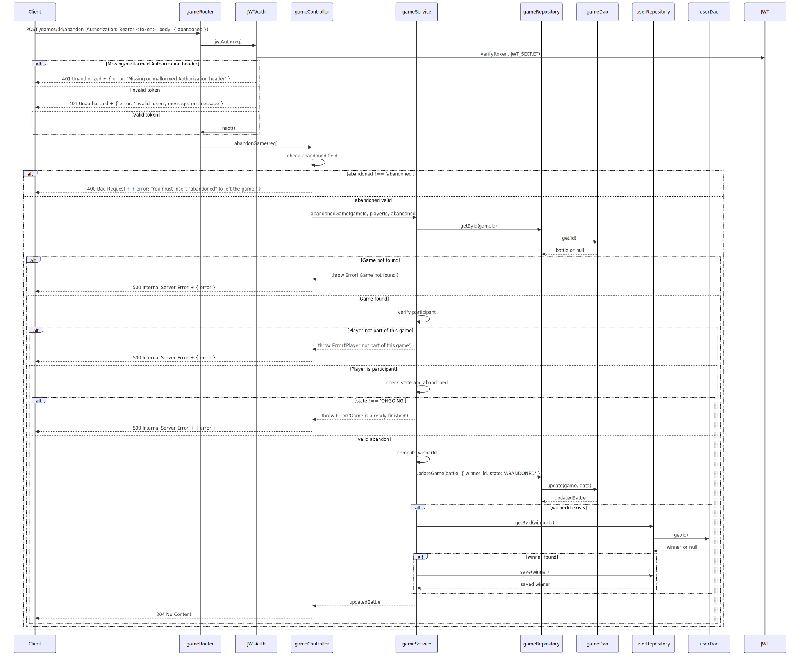

# 🚢 BATTLESHIP – Backend
Il seguente progetto è stato sviluppato come parte dell’esame di **Programmazione Avanzata** (A.A. 2024/2025) presso l'**Università Politecnica delle Marche**, all’interno del **Corso di Laurea Magistrale in Ingegneria Informatica e dell’Automazione (LM-32)**.

Il progetto propone un sistema backend per la gestione del gioco della **battaglia navale**, consentendo agli utenti di giocare contro altri utenti o contro un'**intelligenza artificiale (IA)**. Il sistema supporta la gestione di più partite contemporaneamente, sebbene ciascun utente possa partecipare attivamente a una sola partita alla volta.

## Strumenti utilizzati
- **Linguaggio**: TypeScript
- **Backend**: Node.js + Express
- **ORM**: Sequelize
- **Database**: PostgreSQL
- **Autenticazione**: JWT (JSON Web Tokens)

## Funzionalità principali
L’utente ha la possibilità di:

 * Creare una nuova partita, specificando:
   - Tipo di avversario (utente o IA),
   - Email dell’avversario (se presente),
   - Griglia di gioco,
   - Numero e dimensioni delle navi,
* Effettuare una mossa a turno, con accesso allo **storico delle mosse** della partita corrente;
* Valutare lo **stato della partita** (ONGOING o FINISHED, current_turn_user, winner_id, ecc.)

## Obiettivi di Progetto
Per raggiungere gli obiettivi del progetto è stato necessario implementare le seguenti funzionalità:
Login dell’utente tramite email e autenticazione mediante JWT. 
- Ricarica del wallet di token, necessari per la creazione delle partite e l’esecuzione delle mosse. Questo può essere eseguito esclusivamente dall’utente con **role='Admin'**.
- Creazione di una partita, per ogni nuova nuova battaglia partita viene addebitato un numero di 0.20 token dal portafoglio di un utente. 
- Esecuzione di una mossa,in cui l’attaccante deve specificare il numero di riga e di colonna da colpire. Il costo per eseguire una mossa è di 0.01 token da sottrarre al portafoglio dell’attaccante; se il credito, durante una partita, scendesse sotto lo zero, viene data la possibilità di terminarla lo stesso. In caso di vittoria (tutte le navi avversarie distrutte) il vincitore riceve 1 punto di score.
- Restituzione dello storico delle mosse svolte durante una partita. 
- Valutazione dello stato di una partita, in cui è possibile vedere le informazioni rilevanti.
- Abbandonare una partita in corso, un utente nel suo turno può decidere di abbandonare una partita e arrendersi al suo avversario. In caso di abbandono il vincitore riceve 0.75 punti di score.
- Ritornare la classifica degli utenti in modo decrescente in base allo score di partite vinte.

## Struttura del Progetto
<pre>  
BATTLESHIPS/
├── dist/
├── mermaid/
├── node_modules/
├── src/
│   ├── @types/
│   ├── controller/
│   ├── dao/
│   ├── database/
│   ├── factory/
│   ├── middleware/
│   ├── models/
│   ├── repository/
│   ├── routes/
│   ├── service/
│   └── app.ts
├── test/
├── .gitattributes
├── docker-compose.yaml
├── dockerfile
├── jest.config.js
├── package-lock.json
├── package.json
├── README.md
├── sequelize-config.json
└── tsconfig.json
  </pre>

  ##  Pattern Architetturali Utilizzati

###  Model-Service-Controller (MSC)
Il progetto adotta il pattern architetturale **Model–Service–Controller**, comunemente utilizzato nello sviluppo di applicazioni backend per garantire una chiara separazione delle responsabilità tra i componenti e migliorare la manutenibilità del codice.. A differenza del tradizionale pattern MVC (Model-View-Controller) , l’MSC non prevede l’implementazione della vista, ma si concentra interamente sulla logica di business e sulla gestione delle API.
La logica è suddivisa in:
 - **Model**: responsabile della gestione della persistenza dei dati e dell’interazione con il database.
   - Modelli: `Player`, `Game`, `Move` (generati tramite Sequelize, sfruttando il collegamento con PostgreSQL)
   - Modello `Grid`: sviluppato manualmente, contiene logica per la creazione delle griglie di gioco e l'allocazione randomica delle navi
 - **Service**: componente in cui risiede la logica di business dell’applicazione e che si interfaccia con le sorgenti dei dati. Classi:
   - `AuthService`, `UserService`, `GameService`, `MoveService`
 - **Controller**: componente che si occupa di ricevere le richieste dal client e 'smistarle' ai rispettivi Service, in modo da restituire la risposta apporpriata al clien. Classi:
   - `UserController`, `GameController`, `MoveController`  

---

###  DAO (Data Access Object)

Il DAO è un pattern architetturale che fornisce un’interfaccia astratta per l’accesso ai dati, interponendosi tra i model Sequelize e i repository. In Battleship è stato utilizzato per implementare la logica di accesso ai dati sfruttando i metodi già forniti da Sequelize come: findByPk, findByEmail, findAll, update, create e delete.

- DAO implementati: `userDao`, `gameDao`, `moveDao`
- Implementano l’interfaccia `IDao` con metodi CRUD standardizzati (`create`, `read`, `update`, `delete`)

---

###  Repository

Il Repository è un pattern architetturale che introduce un ulteriore livello di astrazione per la persistenza dei dati, fungendo da intermediario tra DAO e Service. Nel progetto ogni repository implementato è associato a un singolo DAO di riferimento.
- Repository implementati: `userRepository`, `gameRepository`, `moveRepository`
---

###  Singleton

Singleton è un design pattern creazionale che garantisce che una classe abbia una sola istanza e fornisce un punto di accesso globale a questa istanza. In Battleships viene utilizzato per la **connessione al database PostgreSQL**, garantendo che esista una sola istanza condivisa e riutilizzabile in tutta l’applicazione.

---

###  Factory
Il Factory Pattern, o modello di fabbrica, è un pattern creazionale che fornisce un'interfaccia per creare oggetti. 
Nel progetto è stata adottata una **errorFactory** per la gestione centralizzata degli errori. Questa classe si occupa di creare dinamicamente oggetti di errore sulla base dello status-codes, restituendo un messaggio di errore personalizzato. L'utilizzo di questo pattern consente: 
- Centralizzare la creazione e la tipizzazione degli errori in un'unica posizione.
- Facilità di estensione.
- Aumenta la flessibilità e la manutenibilità del codice.

L'errore generato dalla factory viene poi gestito da un middleware `errorHandler`, che intercetta tutte le eccezioni emerse durante l’elaborazione delle richieste e restituisce una risposta HTTP strutturata al client.

---

###  Chain of Responsibility
Il Chain of Responsibility Pattern è un pattern comportamentale che permette di passare una richiesta attraverso una catena di oggetti riceventi o **handlers**. Ogni handler decide se gestire la richiesta o passarla direttamente al componente successivo della catena. Questo pattern è stato applicato in Battleship tramite il sistema di **middleware** offerto da Express.js. I middleware sono funzioni intermedie che vengono eseguite in sequenza quando una richiesta HTTP viene ricevuta. Sono state utilizzate per implementare le seguenti logiche: 
- Validazione dei parametri e del body delle richieste,
- Autenticazione e autorizzazione JWT, per proteggere le rotte e verificare i ruoli utente,
- Gestione degli errori, intercettando e inoltrando le eccezioni all’errorHandler.

Middleware presenti in Battleships: `adminValidator`, `loginValidator`, `gameValidator`, `moveValidator`, `ErrorHandler`, `jwtAuth`, 

---

###  Diagramma E-R

## 👨‍💻 Autore

**Riccardo Angelini**  
Sviluppato per il corso di *Programmazione Avanzata*, supervisionato dal **Prof. Adriano Mancini**.

